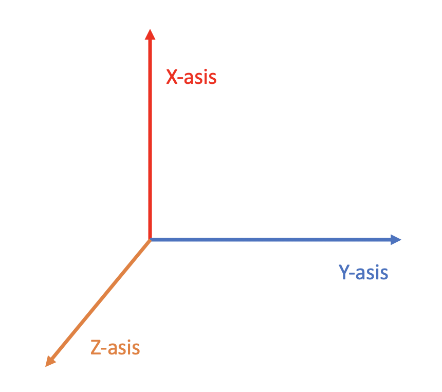
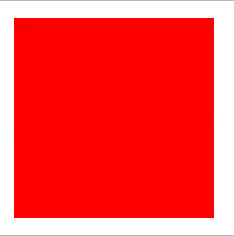
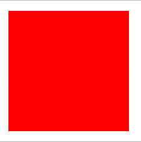

# Animation

`Animation`을 적용할 때는 **CSS를 이용하는 방법**과 **JS를 이용하는 방법**이 있다. 여기서는 CSS를 이용하는 방법에 대해서 정리한다.


## 2D Transforms

특정 Element를 회전시키고, 크기를 늘렸다 줄이고 하는 등 변형하는 방법이 있다.


`translate()`

```css
transform: translate([X-asix], [Y-axis]);
```

- X, Y 만큼 이동


`rotate()`

```css
transform: rotate(20deg);
```

- 시계방향으로 deg만큼 회전


`scaleX()`

```css
transform: scaleX(N);
```

- width의 N배만큼 확장


`scaleY()`

```css
transform: scaleY(N);
```

- height의 N배만큼 확장


`scale()`

```css
transforM: scale(X, Y);
```

- width의 X배, height의 Y배만큼 확장


`skewX()`

```css
transform: skewX(20deg);
```

- 가로방향으로 20 degree만큼 비스듬히 변형


`skewY()`

```css
transform: skewY(20deg);
```

- 세로방향으로 20 degree만큼 비스듬히 변형


`skew()`

```css
transform: skew(20deg, 10deg);
```

- 가로방향 20 degree, 세로방향 10 degree 만큼 비스듬히 변형


`matrix()`

```css
transform: matrix(scaleX(),skewY(),skewX(),scaleY(),translateX(),translateY());
```


## 3D Transforms



`rotateX()`

```css
transform: rotateX(150deg);
```


`rotateY()`

```css
transform: rotateY(130deg);
```


`rotateZ()`

```css
transform: rotateZ(90deg);
```


## Transitions

CSS Property에 대해서 duration을 주고 부드럽게 변하게 하는 방법이다.


### :heavy_check_mark: Transition 적용

- 효과를 적용할 property를 지정
- 효과의 지속 시간(duration) 지정


#### Example

```css
div {
  width: 100px;
  height: 100px;
  background: red;
  transition: width 2s;
}

div:hover {
  width: 300px;
}
```


### 다양한 transition 종류

- `ease` : 느리게 시작하고, 빨랐다가 다시 느리게 끝남
- `linear` : 시작부터 끝까지 동일한 속도
- `ease-in` : 느리게 시작
- `ease-out` : 느리게 끝남
- `ease-in-out` : 느리게 시작, 느리게 끝남
- `cubic-bezier(n,n,n,n)` : 커스터마이징할 수 있는 함수

```css
#div1 {transition-timing-function: linear;}
#div2 {transition-timing-function: ease;}
#div3 {transition-timing-function: ease-in;}
#div4 {transition-timing-function: ease-out;}
#div5 {transition-timing-function: ease-in-out;}
```


## Animation 적용

CSS Animation을 적용하려면 `animation` 속성과 `하위 속성`을 이용한다.


### @keyframes Rule

animation을 적용하기 전에 animation 규칙을 정의하는 것이 필요하다. 이 때 `keyframes`를 활용한다.

#### 1. `from`, `to`

keframes 안에 from과 to를 활용해서 시작과 끝을 정의할 수 있다.

`from`은 **0%(start)** `to`는 **100%(end)**이다.

```css
@keyframes example {
  from {background-color: red;}
  to {background-color: yellow;}
}
```




#### 2. `%` 활용

%에 0~100 사이의 숫자를 지정함으로써 각 타이밍마다 적절한 property를 정의할 수 있다.

```css
@keyframes example {
  0%   {background-color: red;}
  25%  {background-color: yellow;}
  50%  {background-color: blue;}
  100% {background-color: green;}
}
```




### animation 속성

`animation`은 `하위 속성`을 축약해서 표현한다.

문법은 아래와 같다.

```
animation: animation-name | animation-duration | animation-timing-function | animation-delay | animation-iteration-count | animation-direction | animation-fill-mode | animation-play-state.
```

- 이름 > 실행속도 > 속도곡선타입 > 딜레이시간 > 반복횟수 >  진행방향 > 끝난후위치 > 실행or정지


`animation-name`

- 애니메이션 **이름**
- `keyframes`을 지정한다.


`animation-duration`

- **실행 속도**


`animation-timing-function`

- 애니메이션의 **진행 속도**를 정의


`animation-delay`

- 애니메이션의 **시작 딜레이** 


`animation-iteration-count`

- 애니메이션의 **반복 횟수**


`animation-direction`

- 애니메이션의 **진행 방향**


`animation-fill-mode`

- 애니메이션의 **끝난 후의 위치**


`animation-play-state`

- 애니메이션을 **실행할지 정지할지**를 결정