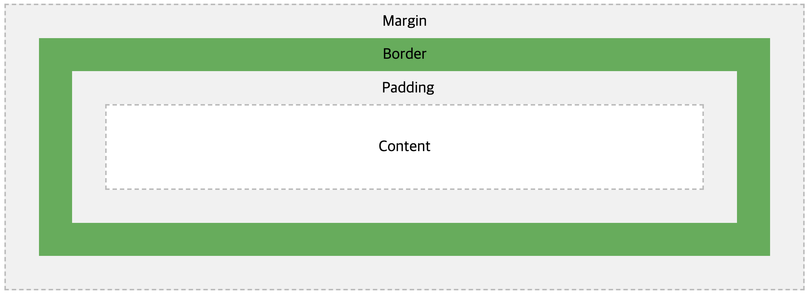

# CSS Box Model

모든 HTML Element는 **Box 형태**로 간주한다. 

Box라고 하면 보통은 레이아웃, 디자인을 생각하면 된다.


## 구성 요소

일반적으로 **div**의 형태는 아래와 같다.



4가지 요소로 이루어져 있고 아래와 같다.

- Margin
- Border
- Padding
- Content


### 1. Margin

- Border의 바깥 영역
- Box와 Box 사이의 공간을 두고 싶을 때 Margin을 조절한다.


### 2. Border

- Padding과 Content를 감싸고 있는 영역
- 일반적으로 Box의 테두리라고 생각하면 된다.


### 3. Padding

- Content 주변의 영역으로 Border 안쪽의 공간을 조절


### 4. Content

- Box의 실제 컨텐츠
- Text나 Image 같은 실제 내용물이 담긴다.


## Margin과 Padding의 속성

Margin과 Padding 모두 Box의 크기, 공간에 영향을 준다.

Margin은 Box 바깥쪽, Padding은 Box 안쪽의 공간을 조절한다고 생각하면 쉽다.


### Margin

margin에는 4가지 세부 속성이 있고, margin 자체에 값을 지정해서 설정이 가능하다.

- margin-top
- margin-bottom
- margin-left
- margin-right


#### 1. 기본적으로 세부 속성 4가지를 사용

```css
margin-top: 1px;
margin-bottom: 2px;
margin-left: 3px;
margin-right: 4px;
```


#### 2. margin 자체에 값을 지정(<u>4 value</u>)

margin 자체에 4가지 값을 지정해서 설정할 수 잇는데 **top 부터 시계 방향 으로 지정**한다고 생각하고 값을 순서대로 기입한다.

```css
/* margin: top right bottom left; */
margin: 10px 20px 30px 40px;
```


#### 3. margin 자체에 값을 지정(<u>3 value</u>)

margin에 3개의 값을 지정할 때에는 `top`, `left, right`, `bottom` 순서대로 값을 지정한다.

```css
/* margin: top left/right bottom; */
margin: 10px 20px 30px;
```


#### 4. margin 자체에 값을 지정(<u>2 value</u>)

margin에 2개의 값을 지정할 때에는 `top, bottom`, `left, right` 순서대로 값을 지정한다.

```css
/* margin: top/bottom left/right */
margin: 10px 30px;
```


#### 5. margin 자체에 값을 지정(<u>1 value</u>)

margin에 1개 값을 지정하면 **위, 아래, 왼쪽, 오른쪽** 모두에 적용된다.

```css
margin: 20px;
```


### Padding

:exclamation: Margin과 같은 원리이다. 접두사만 `padding` 으로 바꿔주면 된다.


## Border 속성

