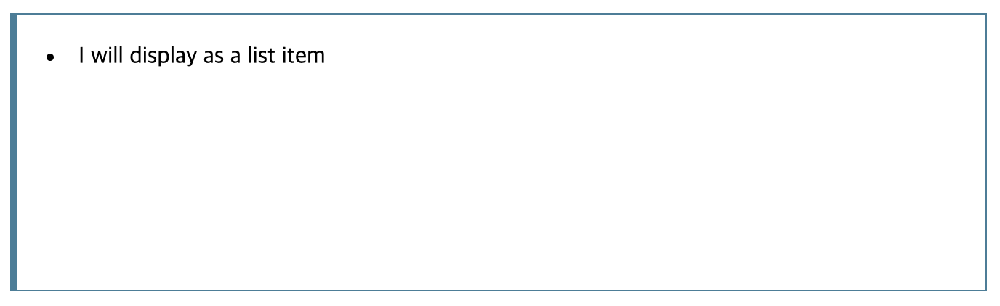

# Display

> Display는 element가 block 또는 inline인지를 결정하거나 child element의 레이아웃을 결정한다.(grid, flex, flow layout)


## Display Syntax

```css
.container {
  display:  [ <display-outside> || <display-inside> ] | <display-listitem> | <display-internal> | <display-box> | <display-legacy> ;
}
```

### :banana: display-outside

Wapper 역할(?)을 하는 Element 즉, Element의 Child가 아닌 **Element 자체의 레이아웃 스타일** 지정


#### 1. block

- Block Element를 만든다.
- `Line Breaks(줄바꿈)`을 **Element의 앞, 뒤에 생성**
- Element는 **한 라인을 점유**한다.


#### 2. inline

- Inline Element를 만든다.
- **Line Breaks를 생성하지 않는다.**
- Element의 child의 크기만큼 공간을 차지


#### 3. run-in

- Element의 전, 후에 따라서 display를 결정한다.
- 하지만 개발자의 의도와는 다르게 동작하는 경우가 있어서 잘 쓰지는 않는다.


### :banana: display-inside

Element의 **Child Element**의 레이아웃 스타일 지정


#### 1. flow

- flow layout을 사용하여 컨텐츠를 구성한다.
- Outer display의 영향을 받아서 Inline에 속하면 Inline 스타일의 컨테이너를 생성하고, Block에 속하면 Block스타일의 컨테이너를 생성한다.
- `position`, `float`, `overflow` 같은 다른 Property와 Block 또는 Inline Formatting Context에 속하는지에 따라 Parent Element의 Formatting Context를 생성한다.


#### 2. flow-root

- 새로운 Block Formatting Context를 만든다.
  - 일반적으로 Web을 구성하는 HTML같은 레이아웃을 만든다고 보면 된다.


#### 3. table

- HTML의 \<table\> Element와 같은 block level의 레이아웃 지정


#### 4. flex

- Flexbox 모델에 따른 레이아웃 지정
- Safari에서는 `-webkit-` 접두사를 붙여야 한다.


#### 5. grid

- Gird 모델에 따른 레이아웃 지정


### :banana: display-listitem

일반적으로 생각하는 List Item (\<li\>)처럼 보이게 된다.

```html
<div class="fake-list">I will display as a list item</div>
```

```css
.fake-list {
  display: list-item;
  list-style-position: inside;
}
```




### :banana: display-internal

table, ruby 등 일부 레이아웃 모델의 내부에서 쓰일 값들을 지정

값들만 정리

- table-row-group
- table-header-group
- table-footer-group
- table-row
- table-cell
- table-column-group
- table-column
- table-caption
- ruby-base
- ruby-text
- ruby-base-container
- ruby-text-container


### :banana: display-box


#### 1. contents

- Container를 없애고, Container에 있던 child를 다음 Element로 만든다.
- Element의 속성을 텍스트같은 속성으로 만든다. (border나 width 다른 요소 적용 불가능)
- IE나 Edge에서 작동하지 않는다.


#### 2. none

- Element를 display 하지 않는다.


### :banana: display-legacy


#### 1. inline-block

- inline box로 감싸진 block element를 생성
- Inline이지만, Block의 특징을 갖는다.
  - :exclamation: Inline과 다른 점은 너비와 높이를 지정할 수 있고, `margin`과 `padding-top/bottom `그리고 `line-height`를 지정할 수 있다.
- `inline flow-root` 와 같다.


#### 2. inline-table

- HTML에 직접 매핑되지 않으면서, `<table>` 형태의 Element처럼 동작
- `inline table` 와 같다.


##### 3. inline-flex

- Inline 형태이고, child element는 flex box 형태로 동작
- `inline flex` 와 같다.


#### 4. inline-grid

- Inline 형태이고, child element는 grid 형태로 동작
- `inline grid` 와 같다.