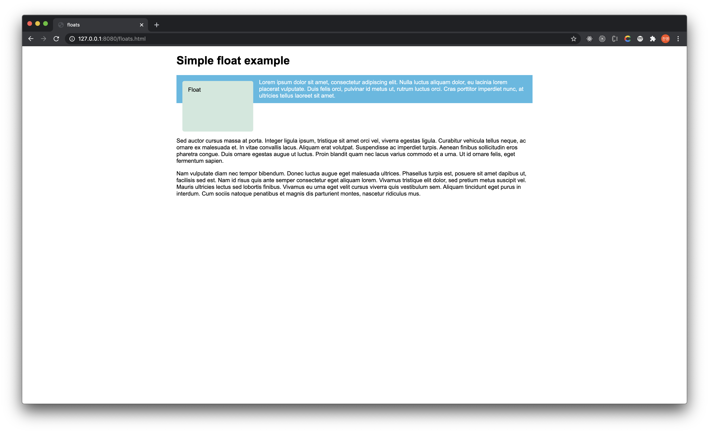

# Floats

## Background

Floats는 웹 페이지에서 **여러 Column으로 이루어진 구조**를 만들기 위해서 사용한다.

보통은 HTML 요소들은 Top-Down 식으로 row by row로 차곡차곡 아래에 쌓인다. 이것을 한 row에 여러가지 요소를 배치하기 위한 방법 중 하나인 floats 속성에 대해서 정리한다.

사실 이런 레이아웃을 구성하는 방법에는 `Flexbox`나 `Grid` 와 같은 더 좋은 방법들도 많다. 그래서 Floats는 약간 **legacy한 기술**이라고도 말한다.


## Simple Example

### Basic Page


```html
<h1>Simple float example</h1>

<div class="box">Float</div>

<p>Lorem ipsum dolor sit amet, ... </p>

<p>Sed auctor cursus massa at porta. ...</p>

<p>Nam vulputate diam nec tempor bibendum. ...</p>

```

```css
body {
  width: 90%;
  max-width: 900px;
  margin: 0 auto;
  font: .9em/1.2 Arial, Helvetica, sans-serif
}

.box {
  width: 150px;
  height: 100px;
  border-radius: 5px;
  background-color: rgb(207,232,220);
  padding: 1em;
}
```

- 일반적으로 태그를 작성했을 때의 Top-Down 형태의 페이지


### Float 추가


```css
.box {
	float: left;
	margin-right: 15px;
}
```

- Basic Page의 box에 `float: left `추가


### 첫 번째 p 태그에 배경색 추가

- float 효과를 좀 더 쉽게 보기 위해서 p 태그에 배경색을 추가
- `float: left`로 인해 구조가 변경되도 p 태그는 full witdh를 유지하고 있음을 볼 수 있다.


```css
.special {
  background-color: rgb(79,185,227);
  padding: 10px;
  color: #fff;
}
```

### Clear 속성 (float 효과 제거)



```css
.cleared {
	clear: left;
}
```

- **두 번째 p 태그**에 `clear: left;` 속성을 추가
- 기존에 있던 **special** :arrow_right: **wrapper**로 변경, wrapper로 box와 첫 번째 p 태그를 감싸준다.
- clear는 float 속성을 없애는 역할을 한다.

> :exclamation: 하지만 wrapper가 box의 height를 다 커버하지 못한다.
>
> :arrow_right: box의 height를 다 커버하는 방법에는 <u>세 가지</u>가 있다.

1. "clearfix hack"

   ```css
   .wrapper::after {
     content: "";
     clear: both;
     display: block;
   }
   ```

   - `clearfix hack` 이라고 불리는 전통적 방법(?)
   - wrapper 다음에 임의의 block 형태의 컨텐츠를 추가하는 식이다.

2. overflow 이용

   ```css
   .wrapper {
     background-color: rgb(79,185,227);
     padding: 10px;
     color: #fff;
     overflow: auto; 
   }
   ```

   - css의 overflow 속성을 이용하는 방법이다.
   - wrapper의 컨텐츠가 길어지면 `overflow: auto` 를 통해 늘여주는 방법

3. display: flow-root

   ```css
   .wrapper {
     background-color: rgb(79,185,227);
     padding: 10px;
     color: #fff;
     display: flow-root; 
   }
   ```

   - 가장 현대적인(?) 방법
   - 위처럼 block 형태의 레이아웃 시스템에서 **새로운 block element를 생성**하는 속성이다.
   - **:x: 참고로 display의 flex-root 속성은 explorer에서는 지원하지 않는다.**

   