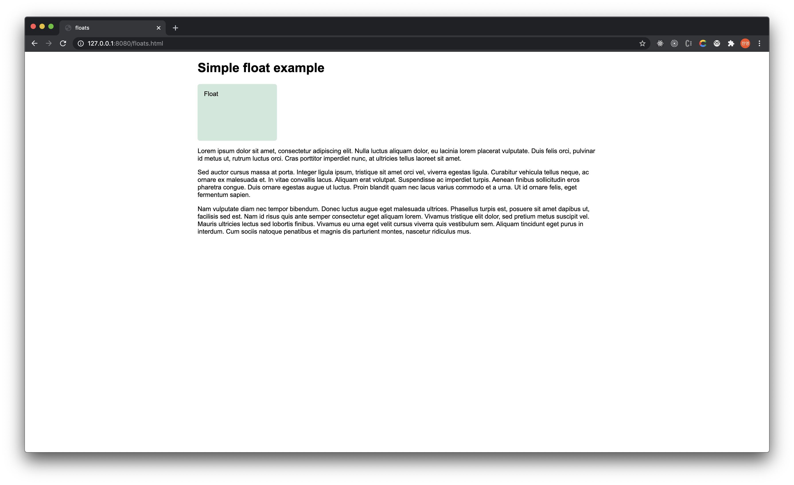
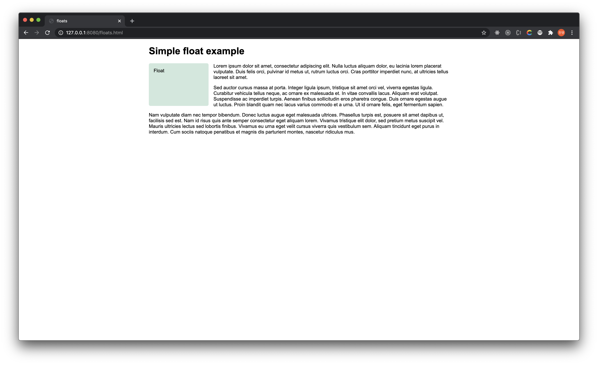
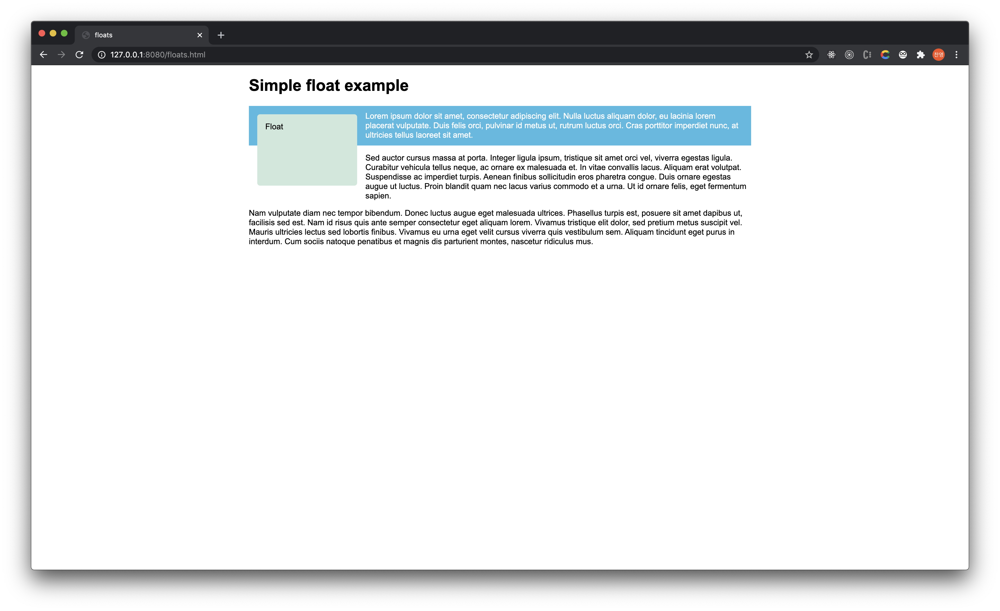

# Floats

## Background

Floats는 웹 페이지에서 **여러 Column으로 이루어진 구조**를 만들기 위해서 사용한다.

보통은 HTML 요소들은 Top-Down 식으로 row by row로 차곡차곡 아래에 쌓인다. 이것을 한 row에 여러가지 요소를 배치하기 위한 방법 중 하나인 floats 속성에 대해서 정리한다.

사실 이런 레이아웃을 구성하는 방법에는 `Flexbox`나 `Grid` 와 같은 더 좋은 방법들도 많다. 그래서 Floats는 약간 **legacy한 기술**이라고도 말한다.


## Simple Example



```html
<h1>Simple float example</h1>

<div class="box">Float</div>

<p>Lorem ipsum dolor sit amet, ... </p>

<p>Sed auctor cursus massa at porta. ...</p>

<p>Nam vulputate diam nec tempor bibendum. ...</p>

```

```css
body {
  width: 90%;
  max-width: 900px;
  margin: 0 auto;
  font: .9em/1.2 Arial, Helvetica, sans-serif
}

.box {
  width: 150px;
  height: 100px;
  border-radius: 5px;
  background-color: rgb(207,232,220);
  padding: 1em;
}
```




