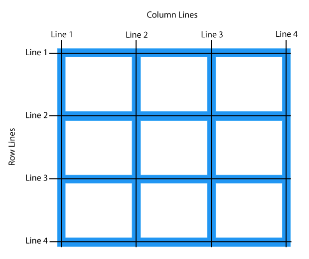
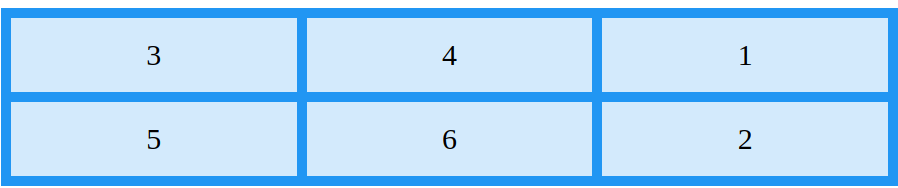
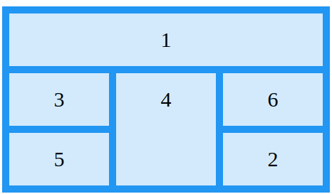

# Grid

Grid는 floats와 positioning 없이 웹 페이지를 `row`와 `column`으로 구성된 **2차원 레이아웃**을 구성

## Flex Box vs Grid

**Flex**는 **한 방향** 레이아웃 (1차원)

**Grid**는 **두 방향(가로,세로)** 레이아웃(2차원)

## 구성요소

Grid는 Flex box와 마찬가지로 `Grid Container`와 `Grid Item`으로 구성된다.

그리고 각각의 Column과 Row 사이 공간을 칭하는 `Gap`과 구분하는 `line`으로 구성된다.


### Container

#### 기본 구성 방법

Gird Container는 아래와 같이 display 속성을 지정해줌으로써 만들어준다.

```css
display: grid;
/* or */
display: inline-grid;
```

그리고 `gird-template-columns` 또는 `grid-template-rows`를 함께 사용해서 기본적인 Grid 형태의 레이아웃을 만들 수 있다.

```css
.grid-container {
	display: grid;
	grid-template-columns: auto auto auto auto;
	grid-template-rows: 200px 500px;
}
```

- 4개의 Column으로 이루어진 Grid
- 각 Row의 높이는 200px, 500px


#### Alignment

기본적으로 Grid 형태를 만들었다면, 왼쪽 위에 붙어 있을 것이다.

이를 `justify-content`와 `align-content` 속성을 이용해서 정렬할 수 있다.

- space-evenly
- space-around
- space-between
- center
- start
- end


### Item

Grid Container는 Grid Item을 포함한다. 이 때 각각의 Column에는 하나의 Grid Item이 들어간다. 하지만 multiple하게 구성할 수 있다.


#### Grid-Column / Grid-Row



```css
grid-column: 1 / 3;
```

- Column의 너비를 1번째 Line부터 3번째 Line까지로 한다는 의미이다.
- 위 그림에서 보이는 Line 1, Line 2 ... 에서 **Line 1부터 Line 3까지**이다.

```css
grid-column: 2 / span 2;
```

- Column을 **2번째 Line부터 시작**하되, **너비는 2만큼** 하겠다는 의미이다.
- 위 그림에서 **Line 2부터 Line 4까지**이다.

> Grid-Row도 마찬가지이다.


#### Grid Area

Grid Area는 `grid-row-start`, `grid-column-start`, `grid-row-end`, `grid-column-end` 속성으로 구성된다.

```css
/* grid-area: grid-row-start / grid-column-start / grid-row-end / grid-column-end */
grid-area: 1 / 2 / 5 / 6;
```


#### Naming Grid Items

`grid-area` 속성을 이용해서 이름을 붙여서 활용할 수 있다.

```css
.item1 {
	grid-area: myArea;
}

.grid-container {
	grid-template-areas: 'myArea myArea myArea myArea myArea';
}
```

- item1에 **'myArea'**라는 이름을 붙였다.
- `grid-template-areas`에 myArea를 5번 반복함으로써 **1 row에 myArea 5개로 구성**한다는 의미로 사용되었다.
- 그리고 **나머지 row에는 5개의 column으로 구성**된다.


```css
.item1 {
	grid-area: myArea;
}

.grid-container {
	grid-template-areas: 'myArea myArea . . .';
}
```

- 각각의 row는 5개의 column으로 구성하고 2개의 span만 myArea로 쓰겠다는 의미


#### Order

각 Grid Item의 위치를 지정할 수 있다.

```css
.item1 { grid-area: 1 / 3 / 2 / 4; }
.item2 { grid-area: 2 / 3 / 3 / 4; }
.item3 { grid-area: 1 / 1 / 2 / 2; }
.item4 { grid-area: 1 / 2 / 2 / 3; }
.item5 { grid-area: 2 / 1 / 3 / 2; }
.item6 { grid-area: 2 / 2 / 3 / 3; }
```

`grid-area` 속성은 위에 나와 있듯이 grid-row-start / grid-column-start / grid-row-end / grid-column-end 순으로 지정한다.




> Media Query를 적용하여 Device에 따라 order를 수정하는 식으로 구현하기도 한다.

```css
@media only screen and (max-width: 500px) {
  .item1 { grid-area: 1 / span 3 / 2 / 4; }
  .item2 { grid-area: 3 / 3 / 4 / 4; }
  .item3 { grid-area: 2 / 1 / 3 / 2; }
  .item4 { grid-area: 2 / 2 / span 2 / 3; }
  .item5 { grid-area: 3 / 1 / 4 / 2; }
  .item6 { grid-area: 2 / 3 / 3 / 4; }
}
```

